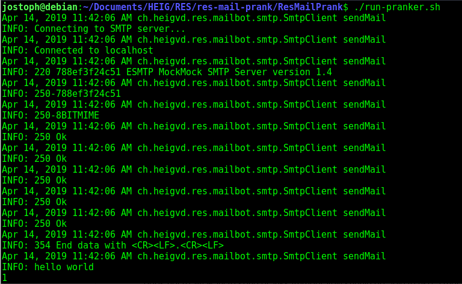

# RES (SMTP) Mail Prank

TCP (SMTP) Application developed as an (**April fool**) exercise in the context of the RES course at the HEIG-VD. I decline all responsiblility in case of harmful use of the application.

## Description

This application takes a list of email addresses and messages from configurable files to generate a given number of random groups and play a prank on them by using on of the addresses as the *sender* and the other as the *recipients*. For each group, when the prank is executed an email with a randomly selected message is send to each *recipient* using the *sender*.

The SMTP server address and port is also chosen in the configuration files. It is possible to test the application locally using MockMock running in a docker container.

## Instructions

### Configure and run the prank application

To use the mail pranker :

- clone or download the repository
- edit the configurable files in the **ResMailPrank/config** folder
  - edit the *config.properties* file with an SMTP serverAddress, a server port and a number of groups you want to make
  - edit the *people.utf8* file by adding the email address you want to play a prank on (at least 3)
  - edit the *messages.utf8* file by adding messages you want to send in the pranks, space them by adding ```---``` on the next line after each new message. (see default messages)
- build the app by executing the *build-prank.sh* bash file in the **ResMailPrank** folder
- run the app by executing the *run-pranker.sh* bash file in the **ResMailPrank** folder

### Set up a mock server

To use the mock server (and try out the application locally) :

- build the docker image by running the *build-image.sh* bash file in the **MockServer/docker** folder
- run the container with MockMock in it by executing the *run-container.sh* in the **MockServer/docker** folder

You can see what emails have been send, by opening an internet browser and going to the ```localhost:8282``` address

## Implementation

### Class diagram


The entry point for the application (main) is the **ResMailPrank** class, it creates a new instances of a **ConfigManager** that is in charge of parsing the configuration files to get the needed data, and an instance of a **PrankGenerator** that uses the **ConfigManager** to create a list of **Prank** objects. A **Prank** is made out of a **Group** composed of a *sender* **Person** and a list of *recipients* **Person**, and a message (String) that will be send.

When the list of **Prank** is generated, an SmtpClient instance will connect to the chosen *SMTP server* and send each created **Mail** object (that we get by calling the ```getMail()``` method on a **Prank**).<br/>
The SmtpClient is writen on a *java Socket* level.

### example (using the default configuration and MockMock)

Consol output when running the prank application with the bash file



Consol output when running the MockMock server with the bash file


View on a browser when receiving the emails


## References

- [HEIG-VD RES repository for this exercise's guidlines](https://github.com/SoftEng-HEIGVD/Teaching-HEIGVD-RES-2019-Labo-SMTP)
- [Docker](https://www.docker.com/)
- [MockMock server](https://github.com/tweakers/MockMock)
- [Simple Mail Transfer Protocol Wikipedia](https://en.wikipedia.org/wiki/Simple_Mail_Transfer_Protocol)
